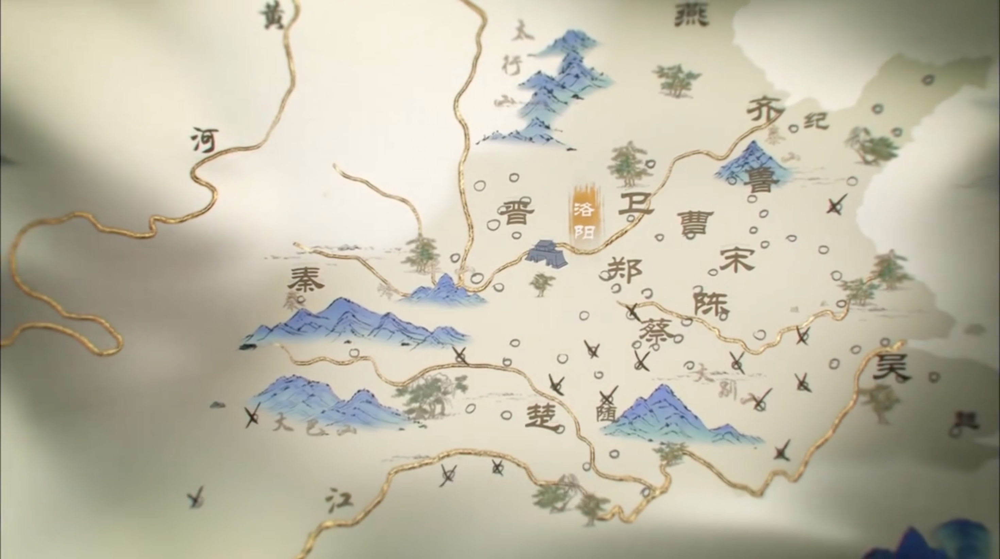
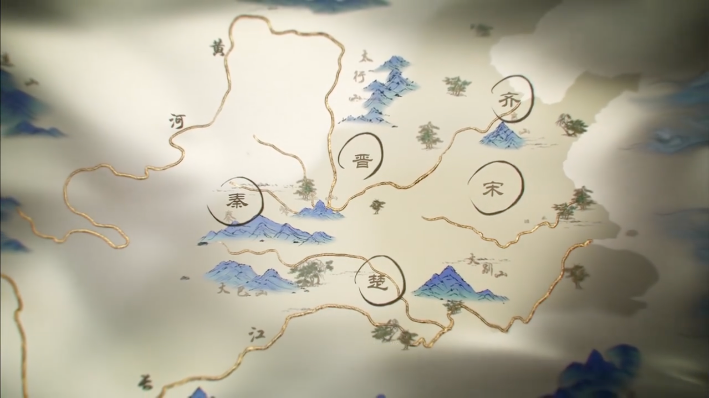

# 春秋战国多角色英语情景（全6关）

​                                                                                                                                                ——**借鉴《中国》第一季纪录片**

# 一、核心设定（适配网页开发+学习需求+纪录片质感）

## （一）基础设定

- **角色多样**：每关用户扮演不同角色（涵盖儒、道、法、贤臣、君主、文人等），语气贴合角色身份（如老子的淡泊），对话贴合纪录片原场景的思想交锋，突出观点碰撞，适配口语讨论。

- **纪录片素材适配（核心降本点）**：每关场景均对应《中国》纪录片不同集的核心片段，标注具体集名、可截取素材（图片/短视频），无需额外制作，贴合纪录片每集不同主题的特点，具体如下：
    - **图片**：截取纪录片中对应场景（如老子隐居处、楚国宫殿等），适配网页静态场景展示。
    - **短视频**：截取纪录片中10-15秒无旁白片段（如老子与孔子对话、墨子献守城器械等），作为每关开篇铺垫，增强代入感。

- **文笔借鉴**：沿用纪录片第三视角叙事风格，剧情铺垫简洁优美、有历史厚重感，避免直白生硬，贴合春秋战国时期的时代氛围，还原纪录片原场景的思想张力。

- **难度梯度**：严格遵循「入门→基础→中级→高级」，每关口语重点差异化，核心词汇/句式逐步复杂，贴合场景难度递进（从简单思想对话→观点争论→劝说辩论→外交交锋→变法阐述），适配口语能力提升。

## （二）网页界面核心设计（贴合你的学习需求，无选项，重自主表达）

- **左侧**：场景展示区（播放纪录片短视频/静态图片）+ NPC与用户角色对话窗口（对话实时滚动，用户台词由自主组织输入）。

- **右侧**：固定任务栏（全程显示当前关卡核心任务+用户扮演角色，清晰明确，不遮挡场景），示例：「当前角色：孔子；当前任务：与老子探讨“道”与“仁”的区别，表达自身思想」。

- **核心提示机制（分两级，侧重口语逻辑+发音纠正，不直接给出答案）**：
    - **一级提示（必显）**：对话窗口下方，显示3个核心关键词提示（贴合当前口语重点+角色身份），偏僻词标注「中文含义+国际音标」，示例：「关键词：Tao（道 /taʊ/）、benevolence（仁 /bəˈnevələns/）、thought（思想 /θɔːt/）」。
    - **二级提示（点击触发，按需使用）**：关键词下方设「提示」按钮，点击后显示完整句式/句型参考（贴合当前对话场景+角色语气，供用户组织语言，强化逻辑），示例：「句式参考：1. I think the core of Tao is...（我认为道的核心是……）；2. There are differences between Tao and benevolence:...（道与仁有所不同：……）」。
    - **发音纠正提示（辅助）**：用户输入台词后，系统自动标注发音易错点（如重音位置、连读技巧），示例：「发音提示：benevolence /bəˈnevələns/（重音在第二音节）；Tao and benevolence（连读：/taʊ ənd bəˈnevələns/）」。

- **进度反馈**：任务栏下方设简易进度条（0%→100%），完成单个小任务更新进度，通关后弹出本章核心词汇+发音总结（可收藏，强化记忆），附加角色相关的纪录片知识点拓展（贴合学习需求）。

# 二、全6关关卡大纲（贴合《中国》纪录片各集，史实准确，口语重点清晰）

| 关卡序号  | 对应纪录片集名 | 用户扮演角色            | 关卡场景（对应纪录片素材）         | 核心NPC | 关卡任务（右侧任务栏显示）                                   | 口语重点（核心句式+关键词）                                  | 纪录片素材截取建议                                           |
| --------- | -------------- | ----------------------- | ---------------------------------- | ------- | ------------------------------------------------------------ | ------------------------------------------------------------ | ------------------------------------------------------------ |
| 1（入门） | 第一集《春秋》 | 孔子 / 老子             | 洛阳城外古道凉亭（老子隐居处附近） | 老子    | 与对方探讨“道”与“仁”的核心，表达自身思想，倾听对方观点       | 核心句式：I think...（阐述观点）；What do you think of...?（询问观点）；There are differences between...（区分不同）关键词：Tao（道 /taʊ/）、benevolence（仁 /bəˈnevələns/）、thought（思想 /θɔːt/） | 1. 短视频：截取「洛阳古道、凉亭，老子与孔子对坐交谈」片段（10秒，无旁白）；2. 图片：老子与孔子对话特写、古道凉亭图。 |
| 2（入门） | 第二集《众声》 | 墨子 / 楚王             | 楚国都城宫殿（楚王议事厅）         | 楚王    | 劝说楚王放弃攻打宋国，阐述“非攻”理念，反驳公输班的攻城之说   | 核心句式：I suggest that...（劝说）；I disagree because...（反驳）；The idea of...is that...（阐述理念）关键词：non-aggression（非攻 /ˌnɒn əˈɡreʃn/）、attack（攻打 /əˈtæk/）、persuade（劝说 /pəˈsweɪd/） | 1. 短视频：截取「楚王与公输班讨论攻城，墨子入宫劝说」片段（12秒）；2. 图片：楚国宫殿内景、墨子献守城器械图。 |
| 3（基础） | 第一集《春秋》 | 孔子 / 子路（弟子）     | 陈蔡交界荒野（陈蔡之围）           | 子路    | 与弟子争论“是否降低儒家标准”，坚守自身理念，引导弟子理解儒家核心 | 核心句式：I insist that...（坚守观点）；We should not...because...（反对理由）；Let me guide you to understand...（引导理解）关键词：Confucianism（儒家 /kənˈfjuːʃənɪzəm/）、standard（标准 /ˈstændəd/）、insist（坚守 /ɪnˈsɪst/） | 短视频：截取「陈蔡交界荒野，孔子与弟子被困，断粮受冻，子路愤懑质问，孔子弦歌不辍」片段（10秒）；2. 图片：荒野被困全景、子路饥饿愤怒特写、孔子抚琴特写。 |
| 4（基础） | 第四集《变革》 | 荀子 / 秦昭王与秦国群臣 | 秦国都城雍城宫殿（议事厅）         | 秦昭王  | 向秦昭王阐述变法理念，说明礼乐并治对秦国的益处               | 核心句式：The core of reform is...（阐述核心）；I refute your view that...（反驳观点）；Reform will help...（说明益处）关键词：reform（变法 /rɪˈfɔːm/）、benefit（益处 /ˈbenɪfɪt/）、refute（反驳 /rɪˈfjuːt/） | 1. 短视频：截取「秦昭王与大臣争论，荀子阐述观点」片段（13秒）；2. 图片：秦国宫殿议事特写、荀子画像。 |
| 5（中级） | 第三集《洪流》 | 庄子 / 惠施             | 濮水河畔（庄子垂钓处）             | 惠施    | 与惠施展开“濠梁之辩”，辩论“子非鱼，安知鱼之乐”，表达道家自然思想 | 核心句式：If you are not..., how can you know...?（反问辩论）；I think that...because...（论证观点）；The idea of nature is...（阐述思想）关键词：debate（辩论 /dɪˈbeɪt/）、nature（自然 /ˈneɪtʃə/）、happiness（快乐 /ˈhæpinəs/） | 1. 短视频：截取「濮水河畔，庄子垂钓，惠施来访辩论」片段（12秒）；2. 图片：濮水河畔景色、庄子与惠施辩论特写。 |
| 6（高级） | 第四集《一统》 | 韩非 / 李斯             | 秦国咸阳牢狱（囚室）               | 李斯    | 面对前来探监的李斯，诉说法家理想与平生志向，坦然直面最终结局 | 核心句式：I still stick to...（坚守理想）；I regret that...（表达遗憾）；I have no hatred for you because...（表达谅解）关键词：legalist（法家 /ˈliːɡəlɪst/）、ambition（志向 /æmˈbɪʃn/）、regret（遗憾 /rɪˈɡret/）、ideal（理想 /aɪˈdiːəl/） | 1. 短视频：截取第四集《一统》中战国末期秦国牢狱相关氛围片段（12秒，无旁白）；2. 图片：秦国牢狱全景、囚室特写、韩非与李斯人物肖像 |

### 地图演变

| 关卡序号 | 内容 & 人物      | 真实历史年份       | 所属纪录片集数  | 选用地图版本                                     |
| -------- | ---------------- | ------------------ | --------------- | ------------------------------------------------ |
| 1        | 孔老洛阳论道     | 前 521（春秋早期） | 第 1 集《春秋》 | **图 1（全小国原版：带洛阳、曹蔡郑卫鲁全邦国）** |
| 2        | 墨子止楚攻宋     | 前 445（春秋晚期） | 第 2 集《众声》 | 图 1 原版                                        |
| 3        | 孔子陈蔡之围     | 前 489（春秋晚期） | 第 1 集《春秋》 | 图 1 原版                                        |
| 4        | 荀况入秦之辩     | 前 255（战国晚期） | 第 4 集《一统》 | **图 2（五大国圈注版，后期删小国、晋拆三晋）**   |
| 5        | 濠梁之辩（庄惠） | 前 323（战国中期） | 第 3 集《洪流》 | 图 2 修改版                                      |
| 6        | 韩非狱中绝言     | 前 233（战国末）   | 第 4 集《一统》 | 图 2 修改版                                      |

图一

图二（五大国圈注版，后期删小国、晋拆三晋）

# 三、全章节详细剧情+对话设计+提示体系

## 第一章 关卡1（入门）：第一集《春秋》·道仁之辩，儒道交锋

### （一）开篇铺垫（借鉴《中国》纪录片文笔+素材）

【纪录片素材】短视频（10秒）：截取《中国》纪录片第一集《春秋》中「洛阳城外古道蜿蜒，凉亭矗立，秋叶飘落；老子身着素色道袍，端坐凉亭品茶，孔子身着儒衫，手持竹简，缓步走来，神色恭敬」片段（无旁白）；静态图片：老子与孔子对话特写、古道凉亭全景、竹简特写（轮换展示）。

【第三视角叙事】春秋中期，礼崩乐坏，诸侯争霸，思想之光却在乱世中悄然绽放。孔子心怀仁政之志，周游列国途中，听闻老子隐居于洛阳城外，遂特意登门拜访。老子，道家之始祖，主张“无为而治”，看透世事浮沉，淡泊名利；孔子，儒家之创始人，坚守“仁与礼”，心怀天下，渴望以学说安邦定国。这一日，古道秋凉，两位思想家端坐凉亭，一场关于“道”与“仁”的思想交锋，悄然拉开序幕。

【右侧任务栏】当前角色：孔子；当前任务：1. 向对方表达拜访之意与敬意；2. 阐述自身核心思想（孔子谈“仁”，老子谈“道”）；3. 倾听对方观点，探讨两者的区别与共通之处。

### （二）场景：洛阳城外古道凉亭（秋，午后）

#### 对话触发

【NPC】老子：（见对方走来，缓缓抬眸，神色平和，抬手示意）Please sit down, dear friend. The autumn wind is cool, and the tea is still warm. What brings you here on this long journey? （抬手示意你坐下，语气平和：请坐，远方的朋友。秋风微凉，茶水尚暖，这般长途跋涉，你为何而来？）

#### 提示体系（贴合入门级，侧重观点阐述+简单对话）

- **一级提示（关键词，必显）**：Tao（道 /taʊ/）、benevolence（仁 /bəˈnevələns/）、respect（敬意 /rɪˈspekt/）、discussion（探讨 /dɪˈskʌʃn/）

- **二级提示（点击「提示」按钮显示，句式参考）**：
    1. （扮演孔子）I come here to pay my respects to you and discuss the ideas of benevolence with you.（我前来向你表达敬意，并与你探讨“仁”的思想。）；
    2. （扮演老子）The core of Tao is "inaction", which means we should follow the laws of nature.（道的核心是“无为”，即顺应自然规律。）；
    3. What do you think is the difference between Tao and benevolence?（你认为道与仁的区别是什么？）

- **发音提示（玩家输入后显示）**：重点标注易错发音——Tao /taʊ/（避免读成/təʊ/）；benevolence /bəˈnevələns/（重音在第二音节，注意结尾/ns/的发音）；discussion /dɪˈskʌʃn/（不发音的/s/省略，避免读成/dɪˈskʌʃən/）

#### 用户对话导向（供参考，自主组织语言输入，贴合角色语气）

- **扮演孔子**（语气恭敬、坚定）：Dear Master Lao, I am Confucius from Lu. I have long admired your wisdom and your theory of Tao, so I made a special trip to visit you. In my opinion, the core of my thought is benevolence—loving the people, respecting etiquette, and using kindness to govern the country. I wonder what you think of benevolence? And what is the true meaning of Tao in your heart?（尊敬的老子先生，我是来自鲁国的孔子。我久仰你的智慧与道学理论，特意前来拜访。在我看来，我的思想核心是“仁”——爱护百姓，尊重礼仪，以仁爱治理国家。不知你如何看待“仁”？你心中“道”的真谛又是什么？）

- **扮演老子**（语气平和、淡泊）：Dear Confucius, I appreciate your sincerity. The Tao I advocate is invisible and omnipresent; it follows the laws of nature and does not force anything. Inaction does not mean doing nothing, but not going against nature. You advocate benevolence, which is kind, but the world is in chaos, and excessive intervention may not be a good thing. What do you think of "following nature"?（尊敬的孔子，我感念你的诚意。我所倡导的道，无形无象，无处不在，它顺应自然规律，不刻意强求。无为并非无所作为，而是不违背自然。你倡导的仁，心怀善意，但乱世之中，过度干预或许并非良策。你如何看待“顺应自然”？）

#### NPC回应（贴合角色，推动思想交锋，不设失败结局）

- （用户扮演孔子，NPC为老子）：Your idea of benevolence is noble and kind, Confucius. It is a way to bring warmth to the chaotic world. But nature has its own laws, just like the autumn wind blowing down the leaves—we cannot stop it. Governing a country is the same: if we excessively pursue benevolence and etiquette and go against the laws of the times, it may not achieve the desired effect. However, your persistence in kindness is worthy of admiration.（孔子，你“仁”的理念高尚而善良，是给乱世带来温暖的一种方式。但自然有其规律，就像秋风吹落树叶，我们无法阻挡。治理国家亦是如此，若过度追求仁与礼，违背时代规律，或许难以达到预期效果。但你对善意的坚守，值得敬佩。）

- （用户扮演老子，NPC为孔子）：Thank you for your guidance, Master Lao. I understand your idea of following nature, and it makes me think deeply. But the world is in chaos, and people are suffering. If we only pursue inaction and do not take the initiative to spread kindness and etiquette, how can we comfort the people? I think benevolence and following nature are not completely opposite—benevolence can also be in line with the laws of nature.（多谢老子先生的指点，我理解你顺应自然的理念，也深受启发。但乱世之中，百姓流离失所，苦不堪言。若我们只追求无为，不主动传播善意与礼仪，如何安抚百姓？我认为，仁与顺应自然并非完全对立，仁也可以契合自然规律。）

#### 进度更新+通关总结

- 任务完成，进度条更新至100%，弹出通关提示：「关卡1通关！你成功完成了儒道两位思想家的思想交锋，深入理解了“道”与“仁”的核心差异，下一步，你将化身墨子（或楚王），前往楚国宫殿，劝说楚王放弃攻打宋国，开启关卡2的旅程！」

- **通关总结（核心词汇+发音重点+纪录片知识点，可收藏）**：
    1. 核心词汇：Tao、benevolence、respect、discussion、inaction（无为 /ɪnˈækʃn/）；
    2. 发音重点：掌握Tao、benevolence的正确发音，注意discussion的省略发音技巧；
    3. 纪录片知识点：《中国》第一集《春秋》重点呈现了春秋时期的思想觉醒，老子与孔子的对话是儒道思想的首次重要交锋，奠定了中国古代思想文化的基础。

## 第二章 关卡2（入门）：第二集《众声》·非攻之辩，墨子劝楚

### （一）开篇铺垫（借鉴《中国》纪录片文笔+素材）

【纪录片素材】短视频（12秒）：截取《中国》纪录片第二集《众声》中「楚国都城宫殿巍峨，楚王端坐王座，公输班手持攻城器械模型，躬身汇报；墨子身着粗布衣衫，手持守城器械，大步走入宫殿，神色坚定，目光锐利」片段（无旁白）；静态图片：楚国宫殿内景、公输班攻城模型、墨子守城器械特写（轮换展示）。

【第三视角叙事】春秋晚期，诸侯争霸愈演愈烈，大国欺凌小国，战争频发，百姓流离失所。楚国国力强盛，楚王好大喜功，听闻公输班发明了新式攻城器械，便决意攻打弱小的宋国，掠夺土地与人口。墨子，墨家学派创始人，坚守“兼爱、非攻”理念，听闻楚国将攻打宋国，心急如焚，不顾路途遥远，从鲁国徒步前往楚国，孤身入宫，欲以一己之力，劝说楚王放弃战事，以“非攻”之道，守护天下百姓的安宁。

【右侧任务栏】当前角色：墨子；当前任务：1. （墨子）向楚王阐述“非攻”理念；2.劝说其放弃攻打宋国

### （二）场景：楚国都城宫殿（议事厅，上午）

#### 对话触发

【NPC】楚王：（见墨子入宫，神色略带不屑，语气傲慢）Who are you? You are dressed in rags, why do you dare to break into my palace? Do you know that I am going to send troops to attack Song?（见你入宫，语气傲慢：你是谁？衣衫褴褛，竟敢闯入我的宫殿？你可知我即将出兵攻打宋国？）

#### 提示体系（贴合入门级，侧重劝说+简单反驳）

- **一级提示（关键词，必显）**：non-aggression（非攻 /ˌnɒn əˈɡreʃn/）、attack（攻打 /əˈtæk/）、persuade（劝说 /pəˈsweɪd/）
- **二级提示（点击「提示」按钮显示，句式参考）**：
  1. （扮演墨子）I am Mozi, and I come here to persuade you to give up attacking Song. The idea of non-aggression is to love all people equally and oppose wars.（我是墨子，前来劝说你放弃攻打宋国。非攻的理念，就是平等爱护所有百姓，反对战争。）；
  2. （扮演楚王）Attacking Song will help expand my territory and enhance the prestige of Chu. Why should I give it up?（攻打宋国可以扩大我的疆域，提升楚国的威名，我为何要放弃？）；
- **发音提示（玩家输入后显示）**：重点标注——non-aggression /ˌnɒn əˈɡreʃn/（重音在第二音节）；persuade /pəˈsweɪd/（结尾/eɪ/发音饱满，避免读成/pəˈswed/）；defend /dɪˈfend/（重音在第二音节，/e/发音清晰）

#### 用户对话导向（供参考，自主组织语言输入，贴合角色语气）

- **扮演墨子**（语气坚定、沉稳，不卑不亢）：Your Majesty, I am Mozi from Lu. I do not dare to break into your palace intentionally, but I cannot bear to see the people of Song suffer from the war. Attacking Song will not only kill countless innocent people, but also consume a lot of food and troops of Chu. What is the benefit of a war that harms others and does not benefit oneself? I advocate non-aggression and universal love—only by opposing wars can we let the people live in peace. Moreover, I can prove that even with the siege weapons made by Gongshu Ban, you cannot capture Song.（君主陛下，我是来自鲁国的墨子。我并非故意闯入宫殿，只是不忍心看到宋国百姓遭受战乱之苦。攻打宋国，不仅会害死无数无辜百姓，还会消耗楚国大量的粮食与兵力，一场损人不利己的战争，有何益处？我倡导非攻、兼爱——唯有反对战争，才能让百姓安居乐业。况且，我可以证明，即便有公输班制造的攻城器械，你也无法攻下宋国。）

- **扮演楚王**（语气傲慢、疑惑，略带不耐烦）：Mozi, your words are too naive. Chu is a powerful country, and Song is weak and small. Attacking Song is like crushing an ant with a stone. Expanding my territory and making Chu more powerful is my dream. What you call non-aggression is just a useless theory in the chaotic world. How can you prove that I cannot capture Song?（墨子，你的话太过天真。楚国国力强盛，宋国弱小不堪，攻打宋国如同以石击卵。扩大我的疆域，让楚国更加强大，是我的心愿。你所说的非攻，在乱世之中不过是无用的空谈。你如何证明我无法攻下宋国？）

#### NPC回应（贴合角色，推动剧情，呈现思想碰撞）

- （用户扮演墨子，NPC为楚王+公输班）：Gongshu Ban（上前一步，语气傲慢）：Mozi, you are talking nonsense! My siege weapons are invincible. I can break through any city gate in a day!（公输班上前，语气傲慢：墨子，你一派胡言！我的攻城器械天下无敌，一日之内便能攻破任何城门！）；楚王（点头，看向墨子）：Gongshu Ban is right. If you cannot prove your words, I will not give up attacking Song.（楚王点头，看向墨子：公输班说得对，若你无法证明你的话，我不会放弃攻打宋国。）

#### 进度更新+通关总结

- 任务完成，进度条更新至100%，弹出通关提示：「关卡2通关！你成功完成了墨子劝楚的经典场景，深入理解了墨家“非攻”理念的内涵，下一步，你将化身孔子（或子路），前往鲁国曲阜学堂，与弟子争论儒家标准的坚守与变通，开启关卡3的旅程！」

- **通关总结（核心词汇+发音重点+纪录片知识点，可收藏）**：
  1. 核心词汇：non-aggression、attack、persuade、defend、universal love（兼爱 /ˌjuːnɪˈvɜːsl lʌv/）；
  2. 发音重点：掌握non-aggression、persuade的重音与发音，注意defend中/e/的清晰发音；
  3. 纪录片知识点：《中国》第二集《众声》呈现了春秋时期“百家争鸣”的盛况，墨子的“兼爱、非攻”理念，是当时反对战争、追求平等的重要思想，墨子劝楚的故事，也成为中国古代“以理止战”的经典案例。

## 第三章 关卡3（基础）：第一集《春秋》·儒道之争，坚守本心

### （一）开篇铺垫（借鉴《中国》纪录片文笔+素材）

【纪录片素材】短视频（10秒）：截取《中国》纪录片第一集《春秋》中「陈蔡交界荒野，寒风萧瑟，孔子与弟子被大军围困。弟子们面有饥色，虚弱倒地；子路手持兵器，神色愤懑不甘；孔子却面容沉静，端坐于枯草之上，抚琴不辍」片段（无旁白）；静态图片：荒野受困全景、子路愤怒特写、孔子抚琴图（轮换展示）。

【第三视角叙事】公元前489年，春秋晚期。孔子率弟子周游列国，途经陈、蔡两国交界，突遭大军围困。荒野之中，寒风刺骨，孔子一行人已绝粮七日，弟子们饿得无法起身，满心绝望。面对如此穷途末路，生性刚烈的子路再也无法抑制内心的悲愤，他提剑走向孔子，质问为何坚守高尚的道德却落得如此下场。在这个饥寒交迫的绝境中，一场关于“君子固穷”与“是否该妥协降格”的生死之辩，在荒野中悲壮展开。

【右侧任务栏】当前角色：孔子；当前任务：1. （孔子）在绝境中安抚弟子，阐述“君子固穷”的道理，坚守儒家核心标准；2. （子路）在饥寒交迫中表达对现实的绝望，质问“道”的意义，提出妥协求生的建议。

### （二）场景：鲁国曲阜孔子学堂（秋，上午）

#### 对话触发

【NPC】子路：（手持竹简，神色激动，躬身行礼后直言）Master Confucius, I have something to say. We have traveled around the states to promote Confucianism, but no lord is willing to adopt it. Why don’t we lower our standards a little to cater to their needs? Only in this way can our ideas be spread.（手持竹简，神色激动：孔子先生，我有一言要说。我们周游列国传播儒家学说，却没有一位君主愿意采纳。我们为何不稍微降低标准，迎合他们的需求？唯有如此，我们的思想才能得以传播啊。）

#### 提示体系（贴合基础级，侧重争论+引导）

- **一级提示（关键词，必显）**：Confucianism（儒家 /kənˈfjuːʃənɪzəm/）、standard（标准 /ˈstændəd/）、insist（坚守 /ɪnˈsɪst/）、spread（传播 /spred/）

- **二级提示（点击「提示」按钮显示，句式参考）**：
  1. （扮演孔子）I insist that we should not lower our standards. The core of Confucianism cannot be changed.（我坚持认为我们不应降低标准，儒家的核心不可更改。）；
  2. （扮演子路）Master, I know our standards are noble, but if we cannot spread them, what is the use of our ideas?（先生，我知道我们的标准很高尚，但如果无法传播，我们的思想又有何用？）；
  3. Let me guide you to understand that adhering to the original intention is more important than blind spread.（让我引导你明白，坚守本心比盲目传播更重要。）

- **发音提示（玩家输入后显示）**：重点标注——Confucianism /kənˈfjuːʃənɪzəm/（重音在第二音节，注意/juː/的发音）；insist /ɪnˈsɪst/（重音在第二音节，避免读成/ˈɪnsɪst/）；spread /spred/（单音节词，/e/发音清晰，避免读成/spred/）

#### 用户对话导向（供参考，自主组织语言输入，贴合角色语气）

- - 扮演孔子**（语气沉静、坚毅，弦歌不辍）：My dear Zilu, calm down. It is true that we are starving and trapped in this wilderness. A gentleman does face dire straits, but a gentleman remains steadfast in adversity, while a petty person will do anything unethical when facing desperation. The core of Confucianism—benevolence and righteousness—is not a tool to exchange for food or power. Even if the lords of the chaotic world do not accept our high standards, we absolutely cannot lower our beliefs just to survive.（我亲爱的子路，冷静下来。我们确实在这荒野中饥饿受困。君子固然也会遭遇穷途末路，但君子在绝境中依然能坚守本心，而小人一旦穷困就会胡作非为。儒家的核心——仁义，不是用来换取食物或权力的工具。即便乱世的君主不接受我们的高标准，我们也绝不能为了苟活而降低自己的信念。）
  - **扮演子路**（语气绝望、急切，带着哭腔）：Master, I know your "Way" is great! But look at our brothers, they can't even stand up! We traveled through mountains and rivers, only to be rejected by all states. If we just lower our standards a little, cater to the lords' desire for war and power, maybe we wouldn't be starving here today. If we die here, who will spread your ideas?（先生，我知道您的“道”很伟大！但您看看我们的兄弟，他们连站都站不起来了！我们跋山涉水，却被所有国家拒绝。如果我们稍微降低一点标准，迎合君主们对战争和权力的渴望，也许我们今天就不会在这里挨饿。如果我们死在这里，还有谁来传播您的思想呢？）

- NPC回应（贴合角色，推动争论，传递儒家思想）

- （用户扮演孔子，NPC为子路+颜回）：Zilu（神色羞愧，躬身行礼）：Thank you for your teaching, Master. I was wrong. I only thought about spreading our ideas, but forgot the essence of Confucianism. I will adhere to our standards and never mention lowering them again.（子路神色羞愧，躬身行礼：多谢先生教诲，我错了。我只想着传播思想，却忘记了儒家的本质。我会坚守我们的标准，再也不提降低标准的事。）；Yan Hui（端坐起身，语气平和）：Master is right. Adhering to the original intention is the most important thing. Even if we cannot be adopted by the lords, our ideas will shine like stars and illuminate the world in the future.（颜回端坐起身，语气平和：先生说得对，坚守本心最为重要。即便我们无法被君主采纳，我们的思想也会如星辰般闪耀，在未来照亮这个世界。）

#### 进度更新+通关总结

- 任务完成，进度条更新至100%，弹出通关提示：「关卡3通关！你成功完成了儒家标准之争，深入理解了儒家“坚守本心”的核心内涵，下一步，你将化身荀子，前往秦国雍城宫殿，阐述 “礼法并治” 的核心理念，劝说秦国兼顾法治与教化，开启关卡4的旅程！」

- **通关总结（核心词汇+发音重点+纪录片知识点，可收藏）**：
  1. 核心词汇：Confucianism、standard、insist、spread、original intention（本心 /əˈrɪdʒənl ɪnˈtenʃn/）、benevolence and etiquette（仁与礼 /bəˈnevələns ənd ˈetɪket/）；
  2. 发音重点：掌握Confucianism的重音与发音，区分insist的重音位置，注意original intention的连读技巧；
  3. 纪录片知识点：《中国》第一集《春秋》详细记录了孔子周游列国传学的困境，以及他坚守儒家理念、广收弟子的历程，子路与孔子的争论，体现了儒家学说在传播过程中面临的现实困境与坚守。

## 第四章 关卡 4（基础）：第四集《一统》・入秦之辩，强国之思

### （一）开篇铺垫（借鉴《中国》纪录片文笔 + 素材）

【纪录片素材】短视频（13 秒）：截取《中国》纪录片第四集《一统》中「秦国都城咸阳宫殿议事厅，肃穆规整，秦昭王端坐王座，神色沉凝；荀况（荀子）身着儒衫，手持竹简，步履沉稳走入殿中，目光审视殿内群臣；秦国大臣或侧目打量，或面露审视，氛围肃然」片段（无旁白）；静态图片：秦国咸阳宫殿内景、荀况手持竹简特写、秦廷议事群臣群像（轮换展示）。

【第三视角叙事】战国中期，秦国经商鞅变法后国力日盛，已成为西陲霸主，却仍被山东六国视为 “虎狼之国”，诟病其 “重法轻礼、缺乏教化”。荀况，集儒家与法家思想之大成者，既推崇 “礼义教化”，亦认可 “法治约束”，为探究秦国强盛之因、寻强国富民之道，他不顾六国非议，自赵国西行入秦，面见秦昭王与秦国群臣，欲以自身思想，与秦廷探讨 “礼” 与 “法” 如何相融，让秦国不仅有强国之术，更有治国之德。一场关于 “秦之强盛根源” 与 “治国礼法之道” 的辩论，在咸阳宫殿悄然开启。

【右侧任务栏】当前角色：荀况；当前任务：1. （荀况）向秦昭王与群臣分析秦国强盛的优势与弊端，阐述 “礼法并治” 的核心理念，劝说秦国兼顾法治与教化；2. （秦昭王）倾听荀况的观点与大臣的反驳，追问秦国强盛之策，权衡 “法” 与 “礼” 的关系，回应荀况的建议。

### （二）场景：秦国都城咸阳宫殿（议事厅，上午）

#### 对话触发

【NPC】秦昭王：（见荀况入殿，抬手示意免礼，语气沉稳中带审视）Xun Kuang, you have traveled far from the east to enter Qin. The world says Qin is a "state of tigers and wolves" that only values laws and force. What do you see after entering my land, and what words do you bring to me today?（见你入殿，语气沉稳带审视：荀况，你自东方远道入秦。天下皆言秦为 “虎狼之国”，只重律法与武力。入我秦地，你所见如何？今日又有何话要对寡人说？）

#### 提示体系（贴合基础级，侧重分析 + 辩论）

- **一级提示（关键词，必显）**：rite（礼 /raɪt/）、rule of law（法治 /ruːl əv lɔː/）、prosperity（强盛 /prɒˈsperəti/）、enlightenment（教化 /ɪnˈlaɪtnmənt/）
- **二级提示（点击「提示」按钮显示，句式参考）**：
  1. （扮演荀况）I come to Qin to see its prosperity, and I think Qin’s strength lies in strict laws, but it lacks the enlightenment of rites and righteousness.（我入秦见其强盛，认为秦之强在于律法严明，却缺乏礼义教化。）；
  2. （扮演秦昭王）Qin has become powerful by emphasizing the rule of law. Why should we adopt the "rites" you advocate?（秦因重法治而强盛，为何要采纳你所推崇的 “礼”？）；
  3. The way to govern a country is to combine rites with the rule of law, not to value one over the other.（治国之道，当礼法相融，而非重此轻彼。）
- **发音提示（玩家输入后显示）**：重点标注 ——rite /raɪt/（注意与 “right” 同音，避免读成 /rɪt/）；prosperity /prɒˈsperəti/（重音在第二音节，/ɒ/ 发音短促）；enlightenment /ɪnˈlaɪtnmənt/（重音在第二音节，注意 /laɪt / 的连读）

#### 用户对话导向（供参考，自主组织语言输入，贴合角色语气）

- **扮演荀况**（语气沉稳、客观，兼具学者的严谨与辩者的从容）：Your Majesty, I have traveled through the land of Qin, and I see that your country has strict laws, clean officials, and hardworking people—this is the root of Qin’s prosperity, and it is worthy of praise. But the world calls Qin a "state of tigers and wolves" not without reason: Qin values the rule of law to restrain people, but neglects the enlightenment of rites and righteousness. A country that only relies on force and laws can win wars, but cannot win the hearts of the people. I advocate combining rites with the rule of law: use laws to regulate behavior, and use rites to nourish the heart. Only in this way can Qin be truly strong, not just in military power, but in morality and people’s hearts.（大王陛下，我遍历秦地，见贵国律法严明、官吏清廉、百姓勤勉 —— 这是秦强盛之根本，值得称道。但天下称秦为 “虎狼之国” 并非无因：秦重法治以约束人，却轻礼义以教化人。仅靠武力与律法的国家，可胜战，却难收民心。我主张礼法相融：以法规范行为，以礼涵养人心。如此，秦方能真正强盛，不止在武力，更在德化与民心。）
- **扮演秦昭王**（语气威严、务实，略带探寻之意）：Mr. Xun, I acknowledge your insight into Qin’s strengths. But the six eastern states encircle and suppress Qin, and only by strengthening the rule of law and military power can we survive. Rites and enlightenment are like soft water; they cannot stop the swords of the enemy. If we focus on nourishing the heart with rites, will it slow down Qin’s pace of becoming stronger? What concrete methods can you give to combine rites with the rule of law without weakening Qin’s strength?（荀先生，寡人认可你对秦之优势的洞察。但东方六国环伺打压秦国，唯有强化法治、壮大武力，秦方能立足。礼义教化如柔水，挡不住敌国的刀剑。若我们偏重以礼养心，是否会放缓秦变强的步伐？你能否给出具体之法，让礼法相融，又不削弱秦的实力？）

#### NPC 回应（贴合角色，推动辩论，传递思想碰撞）

- （用户扮演荀况，NPC 为秦昭王 + 秦国大臣）：秦国大臣（上前一步，语气强硬）：Xun Kuang! Qin’s laws have made the country stable and the army powerful. Rites are just the empty talk of the weak eastern scholars. If we follow your advice, Qin will lose its edge and be swallowed by the six states!（秦国大臣上前，语气强硬：荀况！秦之律法已让国稳兵强，礼义不过是东方弱儒的空谈。若依你之言，秦将失去锋芒，被六国吞并！）；秦昭王（抬手制止大臣，看向荀况）：The minister’s words are extreme, but they represent the thoughts of many in Qin. Mr. Xun, please answer: how can rites not hinder the rule of law, but complement it?（昭王抬手制止大臣，看向荀况：大臣之言虽偏激，却代表秦廷诸多人心声。荀先生，请你作答：如何让礼不碍法，反辅法？）
- （用户扮演秦昭王，NPC 为荀况）：Xun Kuang（躬身行礼，语气从容）：Your Majesty, I understand your worry about Qin’s survival. Rites do not oppose the rule of law, but perfect it. For example, we can formulate laws that conform to ritual morality—punish those who violate both laws and rites, and reward those who abide by both. In the army, we use laws to enforce military discipline, and use rites to cultivate loyalty and righteousness; among the people, we use laws to maintain order, and use rites to promote filial piety and kindness. In this way, the rule of law is the backbone, and rites are the flesh and blood. Qin’s military power remains, and the people’s hearts are gathered. This is the way to make Qin invincible.（荀况躬身行礼，语气从容：大王，我理解你对秦存续的担忧。礼并非反法治，而是完善法治。譬如，可制定贴合礼德的律法 —— 惩罚既违律又悖礼者，奖赏既守法又循礼者。军中，以法严明军纪，以礼涵养忠义；民间，以法维护秩序，以礼倡导孝悌。如此，法治为骨，礼义为肉。秦的武力不减，民心又聚。这才是秦立于不败之地的根本。）

#### 进度更新 + 通关总结

- 任务完成，进度条更新至 100%，弹出通关提示：「关卡 4 通关！你成功完成了荀况入秦的经典辩题，深入理解了 “礼法并治” 的核心思想，下一步，你将化身庄子（或惠施），前往濮水河畔，展开 “濠梁之辩”，探讨道家自然思想，开启关卡 5 的旅程！」
- **通关总结（核心词汇 + 发音重点 + 纪录片知识点，可收藏）**：
  1. 核心词汇：rite、rule of law、prosperity、enlightenment、morality（德化 /məˈræləti/）、loyalty（忠义 /ˈlɔɪəlti/）；
  2. 发音重点：掌握 rite 的正确发音，区分 prosperity 的重音位置，注意 enlightenment 的连读与重音；
  3. 纪录片知识点：《中国》第四集《一统》展现了战国时期秦国的变革之路，荀况入秦是战国思想交融的重要事件，他的 “礼法并治” 思想，既吸收了法家的务实，又保留了儒家的教化，为后世封建王朝的治国理念奠定了重要基础。

## 第五章 关卡5（中级）：第三集《洪流》·濠梁之辩，自然之心

### （一）开篇铺垫（借鉴《中国》纪录片文笔+素材）

【纪录片素材】短视频（12秒）：截取《中国》纪录片第三集《洪流》中「濮水河畔，杨柳依依，河水潺潺；庄子身着素色道袍，端坐河畔垂钓，神色淡然；惠施身着士大夫服饰，手持羽扇，缓步走来，面带笑意，上前与庄子交谈」片段（无旁白）；静态图片：濮水河畔景色、庄子垂钓特写、庄子与惠施辩论特写（轮换展示）。

【第三视角叙事】战国中期，道家思想日趋成熟，庄子作为道家学派的代表人物，继承并发展了老子的“无为而治”理念，主张顺应自然、淡泊名利，不愿出仕为官，常年隐居于濮水河畔，以垂钓为乐，享受自然之趣。惠施，名家学派代表人物，善于辩论，与庄子是挚友，却又常常因思想不同而展开争论。这一日，惠施特意前往濮水河畔拜访庄子，两人漫步于河畔，见水中鱼儿自在游动，一场流传千古的“濠梁之辩”，就此展开，探讨“知己知彼”与自然本性的真谛。

【右侧任务栏】当前角色：惠施；当前任务：1. 与庄子展开“濠梁之辩”，围绕“子非鱼，安知鱼之乐”进行反问辩论；2. 与庄子辩论，以逻辑反驳庄子的观点，探讨“认知与存在”的关系，展现名家的辩论技巧。

### （二）场景：濮水河畔（庄子垂钓处，春，午后）

#### 对话触发

【NPC】庄子：（缓步走到惠施身边，目光看向水中游动的鱼儿，面带笑意，语气轻松）Hui zi, you are fishing here again. Look at the fish swimming freely in the water—they are so happy. Do you think so?（缓步走到身边，目光看向水中鱼儿，语气轻松：惠施，你又在此垂钓。你看水中自在游动的鱼儿，它们多快乐啊，你觉得呢？）

#### 提示体系（贴合中级，侧重反问辩论+思想阐述）

- **一级提示（关键词，必显）**：debate（辩论 /dɪˈbeɪt/）、nature（自然 /ˈneɪtʃə/）、happiness（快乐 /ˈhæpinəs/）、cognition（认知 /kɒɡˈnɪʃn/）

- **二级提示（点击「提示」按钮显示，句式参考）**：
    1. （扮演庄子）You are not a fish, how can you know that the fish are happy?（你不是鱼，怎么知道鱼是快乐的呢？）；
    2. （扮演惠施）You are not me, how can you know that I do not know the fish are happy?（你不是我，怎么知道我不知道鱼是快乐的呢？）；
    3. The happiness of fish comes from following their nature—this is the true meaning of nature.（鱼的快乐，源于顺应它们的本性，这便是自然的真谛。）

- **发音提示（玩家输入后显示）**：重点标注——debate /dɪˈbeɪt/（重音在第二音节，结尾/eɪ/发音饱满）；nature /ˈneɪtʃə/（重音在第一音节）；cognition /kɒɡˈnɪʃn/（重音在第二音节）

#### 用户对话导向（供参考，自主组织语言输入，贴合角色语气）

- **扮演庄子**（语气淡然、从容，略带随性）：Huishi, you ask me if the fish are happy. But first, I want to ask you—you are not a fish, how can you know that the fish are not happy? The fish swim freely in the water, diving up and down, without worry or trouble. This is their nature, and their happiness is shown in their actions. I sit by the river, watching them follow their nature, so I know they are happy. Just like I follow my nature to fish here, I am also happy—this is the way of nature.（惠施，你问我鱼儿是否快乐。但我先问你——你不是鱼，怎么知道鱼儿不快乐？鱼儿在水中自在游动，上下沉浮，无牵无挂，无忧无虑。这是它们的本性，它们的快乐，就体现在一举一动之中。我坐在河畔，看着它们顺应本性而活，所以我知道它们是快乐的。就像我顺应本性，在此垂钓，我也很快乐——这便是自然之道。）

- **扮演惠施**（语气机智、善辩，逻辑严谨）：Zhuangzi, your words are not logical. You say you know the fish are happy because you watch them. But you are not a fish, you can only see their actions, not their inner thoughts. How can you be sure that they are happy? Besides, you just said I am not a fish, so I cannot know the fish are happy. Then you are not me, how can you know that I do not know the fish are happy? Your argument is contradictory.（庄子，你的话毫无逻辑。你说你看着鱼儿，就知道它们快乐。但你不是鱼，你只能看到它们的动作，看不到它们的内心想法，如何能确定它们是快乐的？况且，你刚才说我不是鱼，所以我不能知道鱼儿快乐。那你不是我，又怎么知道我不知道鱼儿快乐呢？你的论点，本身就是矛盾的。）

#### NPC回应（贴合角色，推动辩论，传递思想）

- （用户扮演庄子，NPC为惠施）：Huishi（抚掌而笑，语气敬佩）：Zhuangzi, you are really good at debating! I thought I could refute you with logic, but I was wrong. You are not talking about logic, but about the nature of things. You see the happiness of fish because you have a heart that follows nature, and you can feel the true feelings of all things in nature. I am too stuck in logic and forget to feel nature itself.（惠施抚掌而笑，语气敬佩：庄子，你果然善于辩论！我本想用逻辑反驳你，却没想到输了。你说的不是逻辑，而是事物的本性。你能看到鱼儿的快乐，是因为你有一颗顺应自然的心，能感受到自然界万物的真情实感。我太过拘泥于逻辑，反而忘记了去感受自然本身。）

- （用户扮演惠施，NPC为庄子）：Zhuangzi（放下鱼竿，哈哈大笑，语气随性）：Huishi, you are always too serious about logic. Let me tell you—the reason I know you do not know the fish are happy is because I know you. You are good at debating, but you always look at things with rationality, not with your heart. The happiness of fish is simple—they swim freely, which is their happiness. You do not need to use complicated logic to judge, you just need to follow your heart and feel it. This is the difference between us.（庄子放下鱼竿，哈哈大笑，语气随性：惠施，你总是太看重逻辑了。我告诉你——我知道你不知道鱼儿快乐，是因为我了解你。你善于辩论，却总是用理性去看待事物，而不是用心去感受。鱼儿的快乐很简单，它们自在游动，便是快乐。不需要用复杂的逻辑去评判，只需顺应本心，去感受就好。这便是你我之间的不同。）

#### 进度更新+通关总结

- 任务完成，进度条更新至100%，弹出通关提示：「关卡5通关！你成功完成了“濠梁之辩”的经典场景，深入理解了道家“顺应自然”的核心思想与名家的辩论技巧，下一步，你将化身韩非，身处秦国咸阳牢狱，面对前来探监的同门李斯，诉说法家理想与平生志向，坦然直面最终结局，开启关卡6的旅程！」

- **通关总结（核心词汇+发音重点+纪录片知识点，可收藏）**：
    1. 核心词汇：debate、nature、happiness、cognition、follow nature（顺应自然 /ˈfɒləʊ ˈneɪtʃə/）、logical argument（逻辑论证 /ˈlɒdʒɪkl ˈɑːɡjumənt/）；
    2. 发音重点：掌握debate、cognition的重音与发音，注意nature的连读技巧，区分happiness的发音；
    3. 纪录片知识点：《中国》第三集《洪流》呈现了道家思想的发展与传播，“濠梁之辩”是庄子与惠施的经典辩论，既展现了名家“重逻辑”的特点，也体现了道家“尊重自然、顺应本心”的核心思想，成为中国古代哲学史上的经典案例。

## 第六章 关卡 6（高级）：第四集《一统》・狱中绝言，法魂落幕

### （一）开篇铺垫（借鉴《中国》纪录片文笔 + 素材）

【纪录片素材】短视频（15 秒）：截取《中国》第一季第四集《一统》中战国末期秦国牢狱相关氛围片段，画面昏暗肃穆，石墙铁栏尽显压抑，搭配古风暗调镜头（无旁白）；静态图片：秦国牢狱全景、囚室特写、韩非与李斯人物肖像（轮换展示）。

【第三视角叙事】战国末年，秦国一统天下的大势已成。韩非，法家集大成者，身负旷世治国之才，因受秦王赏识、遭同门忌惮，被囚禁于秦国牢狱之中。昔日同窗李斯前来探监，二人曾一同师从荀况，怀揣法家强国理想，如今却身处对立境地。李斯奉王命而来，带来一杯毒酒。幽暗囚室之内，昔日同门相对而坐，理想、情谊、命运交织，韩非坦然面对结局，诉说毕生法家抱负与心中遗憾，一场悲怆的临别对话就此展开。

【右侧任务栏】当前角色：韩非；当前任务：面对前来探监的同门李斯，诉说法家理想与平生志向，感慨世事与同门情谊，坦然直面最终结局。

### （二）场景：秦国都城咸阳牢狱（暮夜）

#### 对话触发

【NPC】李斯：（缓步走入囚室，神色复杂，手持酒盏，语气低沉无奈）Old friend, it has been a long time since we met. I come here with a cup of wine. I know you have great talent, but the situation leaves no room for choice.（老友，我们许久未见了。我携酒而来。我知晓你身怀大才，可如今局势，早已身不由己。）

#### 提示体系（贴合高级，侧重情感抒发 + 理想阐述）

- **一级提示（必显关键词）**：legalist（法家 /ˈliːɡəlɪst/）、ambition（志向 /æmˈbɪʃn/）、regret（遗憾 /rɪˈɡret/）、ideal（理想 /aɪˈdiːəl/）
- **二级提示（点击「提示」按钮显示，句式参考）**：
  1. I still stick to the legalist ideas all my life.（我一生始终坚守法家思想。）
  2. It is a pity that I cannot realize my ambition to govern the country.（我遗憾此生无法实现治国的抱负。）
  3. Though our fate is different, I still remember our friendship.（你我命运殊途，但我仍记得往日情谊。）
- **发音纠正提示**：重点标注易错发音 ——legalist /ˈliːɡəlɪst/（重音在第一音节）；ambition /æmˈbɪʃn/（重音在第二音节）；regret /rɪˈɡret/（短元音 /e/，口型收紧）。

#### 用户对话导向（自主组织语言，贴合韩非悲愤又坦然的语气）

- **扮演韩非**（端坐草席，神色平静，眼底藏惋惜与怅然）：I know why you come. We studied together under Xun Kuang in our youth, and we both devoted ourselves to legalist theories. We hoped to use strict laws to stabilize the world and end the wars among vassal states. I never thought we would end up like this. I have no hatred for you. I only regret that I can no longer put my ideas into practice and witness the unification of the whole nation.（我知晓你的来意。年少时你我同拜荀况为师，一同钻研法家学说，立志以严明律法安定天下，终结诸侯战乱。从未想过，你我会落得如今这般境地。我并不怨恨你，只遗憾此生再也无法践行理想，亲眼见证天下一统的时刻。）

#### NPC 回应（贴合李斯矛盾、身不由己的人物状态）

【NPC】李斯：（低头凝视酒盏，面露愧疚）We once shared the same dream. I also admire your talent and insight deeply. But now the whole country is under the rule of Qin. I have my own position and responsibility. Please forgive me for what I have to do.（你我曾经拥有共同的理想，我也一直由衷敬佩你的才华与见解。可如今大秦执掌天下，我身有职责在身，诸多事无可奈何。还望你谅解。）

#### 进度更新 + 通关总结

- 任务完成，进度条更新至 100%，弹出通关提示：「关卡 6 通关！恭喜你完成全 6 关挑战！你沉浸式体验了韩非最后的狱中独白，感悟了法家先贤的理想与无奈。走完这段春秋战国思想之旅，你领略了诸子百家的风采，完成全部英语口语情景练习！」
- **通关总结（核心词汇 + 发音重点 + 纪录片知识点，可收藏）**：
  1. 核心词汇：legalist、ambition、regret、ideal、friendship（情谊 /ˈfrendʃɪp/）、unification（一统 /ˌjuːnɪfɪˈkeɪʃn/）；
  2. 发音重点：掌握 legalist、ambition 的重音规则，区分 regret 短元音发音，注意 unification 的连读技巧；
  3. 纪录片知识点：《中国》第一季第四集《一统》讲述战国末期秦国崛起与天下归一的历程。韩非与李斯同为法家代表，二人的命运折射出战国末年思想者的宿命，法家学说最终成为秦王朝治国的核心思想，深刻影响了后世千年的政治体系。

# 最终总结升华文案（贴合《中国》纪录片风格）

当《中国》纪录片的镜头缓缓掠过春秋战国的古道、宫殿与河畔，那些沉睡千年的历史人物与思想光芒，便在我们的口语情景中，缓缓苏醒。从关卡1儒道交锋的洛阳凉亭，到关卡6韩非狱中绝言的咸阳牢狱；从孔子的坚守本心、老子的顺应自然，到墨子的非攻兼爱、荀子的礼法并治，再到庄子的自然本心、韩非的法家抱负，我们走过的每一关，都是《中国》纪录片中一段鲜活的历史切片，都是一次跨越千年的对话。

这不仅仅是一场英语口语的练习，更是一场沉浸式的历史文化之旅。我们在模拟孔子与老子的对话中，读懂了儒道思想的渊源与碰撞；在演绎墨子劝楚时，体会了“以理止战”的和平初心；在参与儒家标准之争时，见证了“坚守本心”的信念力量；在荀况入秦的辩论中，感悟了“礼法并治”的治国智慧；在濠梁之辩中，领略了道家“顺应自然”的生命哲学；在韩非狱中的绝言里，动容于法家先贤“理想未竟”的悲壮与赤诚。

就像《中国》纪录片所传递的那样，春秋战国不是乱世的代名词，更是中华文明的“黄金时代”——百家争鸣的思想碰撞，铸就了中国传统文化的根基；思想者的坚守与赤诚，凝聚了中华民族的精神底色。我们在练习英语句式、纠正发音的同时，更在与历史对话、与文化同行，读懂了古人的坚守与智慧，明白了中华文明绵延千年、生生不息的密码。

当纪录片的画面再次定格，那些历史人物的身影已然清晰，那些思想的光芒已然照亮前路。这场跨越千年的口语之旅，终会落幕，但春秋战国的历史底蕴、中华传统文化的深厚渊源，会永远留在我们心中，指引我们在传承中前行，在坚守中成长，让千年文明的光芒，在新时代绽放新的光彩。